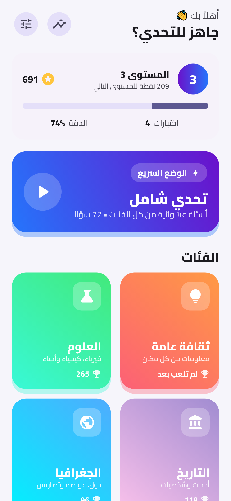
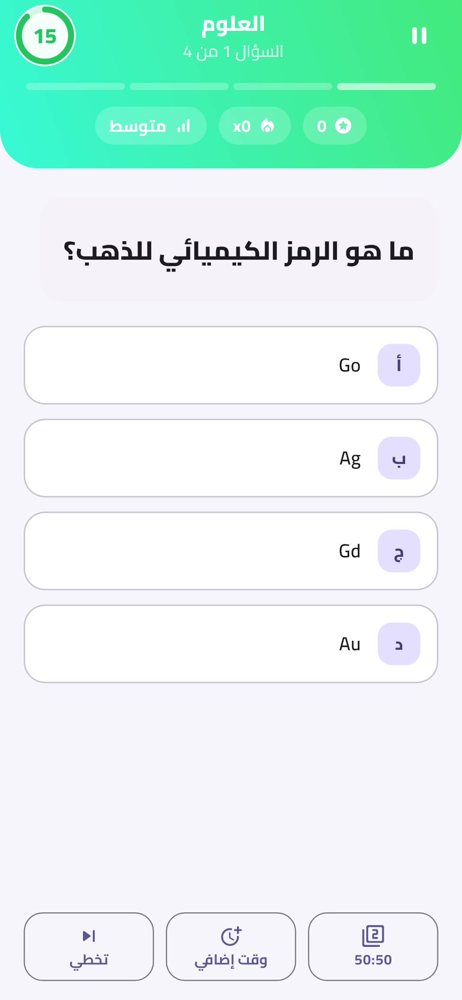
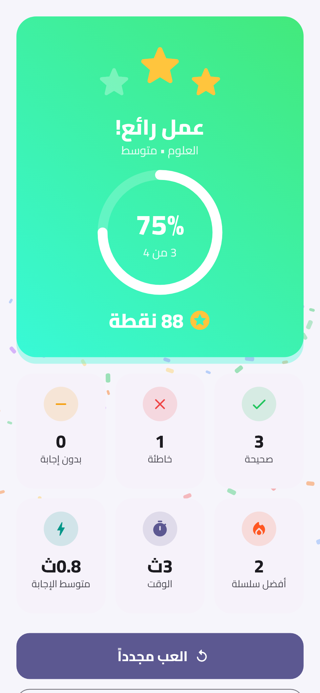
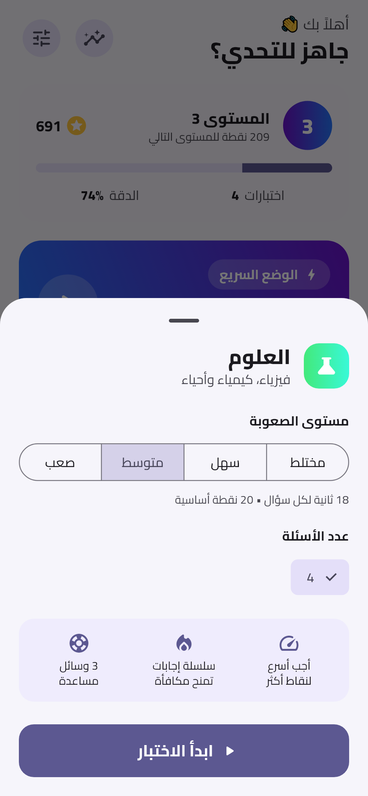
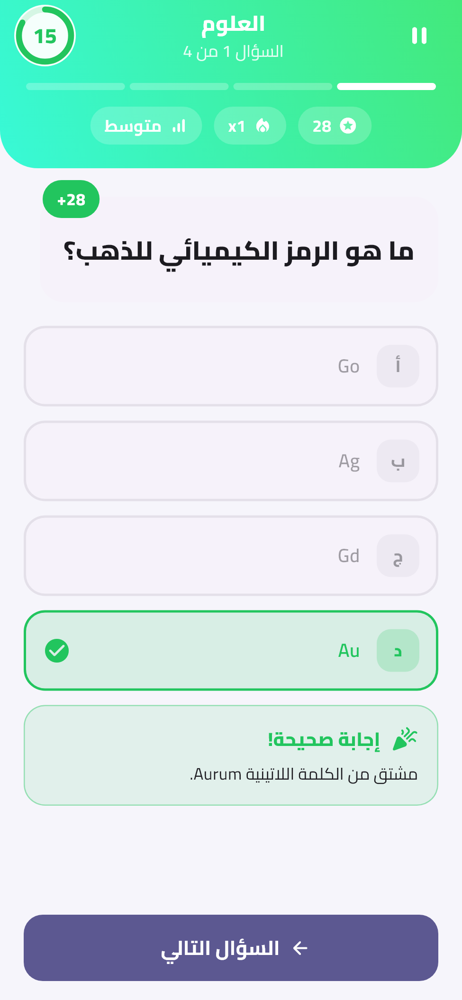
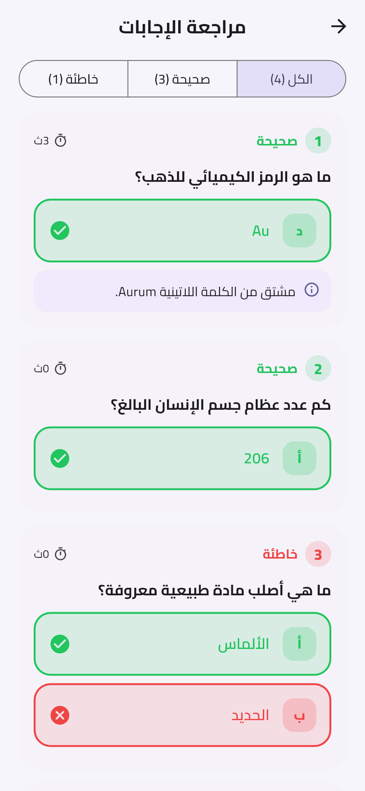
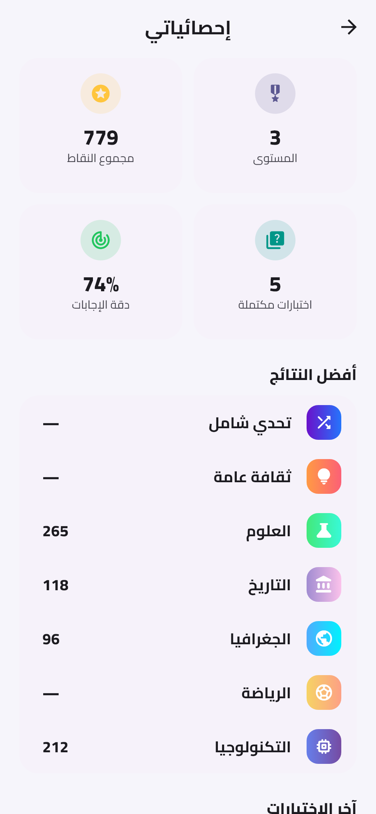
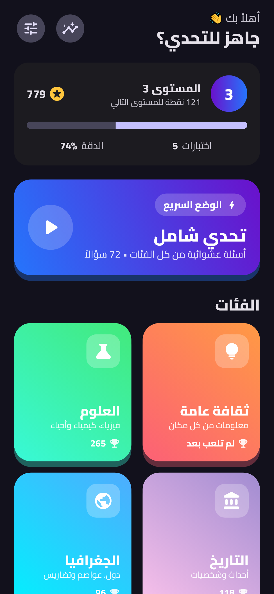

<div dir="rtl">

# كويز 🧠

تطبيق اختبارات معلومات عربي مبني بـ Flutter. فيه 72 سؤال في 6 فئات، مؤقت لكل سؤال، نقاط مكافأة على السرعة والإجابات المتتالية، وسائل مساعدة، وإحصائيات محفوظة على الجهاز.

<p align="center">
  
  
  
</p>

## المميزات

- **واجهة عربية بالكامل** من اليمين لليسار، بخط Cairo المضمّن داخل التطبيق (بيشتغل بدون إنترنت).
- **6 فئات:** ثقافة عامة، علوم، تاريخ، جغرافيا، رياضة، تكنولوجيا. كل فئة فيها أسئلة سهلة ومتوسطة وصعبة.
- **تحدي شامل:** أسئلة عشوائية من كل الفئات.
- **إعداد الاختبار:** اختيار مستوى الصعوبة وعدد الأسئلة. ترتيب الأسئلة والخيارات عشوائي بكل مرة.
- **نظام النقاط:**
  - نقاط أساسية حسب الصعوبة (10 / 20 / 30).
  - مكافأة سرعة تصل لـ 50% من النقاط الأساسية.
  - مكافأة لما تجاوب 3 أسئلة صح ورا بعض أو أكتر.
- **3 وسائل مساعدة** بكل اختبار: حذف إجابتين خاطئتين (50:50)، ووقت إضافي (+10 ثوانٍ)، وتخطّي السؤال.
- **إيقاف مؤقت:** الاختبار بيتوقف لحاله إذا طلعت من التطبيق.
- **شاشة النتيجة:** نجوم، ونسبة الإجابات الصح، وعدّاد نقاط متحرك، وقصاصات احتفال (كونفيتي) مع النتائج المنيحة.
- **مراجعة الإجابات** مع فلترة (الكل، الصحيحة، الخاطئة) وشرح لبعض الأسئلة.
- **الإحصائيات:** مستوى اللاعب، مجموع النقاط، أفضل نتيجة بكل فئة، وسجل آخر 30 اختبار.
- **الإعدادات:** وضع فاتح أو داكن أو تلقائي، الاهتزاز، ومسح البيانات.

## لقطات الشاشة

| الرئيسية | إعداد الاختبار | السؤال | بعد الإجابة |
|:---:|:---:|:---:|:---:|
|  |  |  |  |

| النتيجة | مراجعة الإجابات | الإحصائيات | الوضع الداكن |
|:---:|:---:|:---:|:---:|
|  |  |  |  |

## التشغيل

المتطلبات: Flutter 3.44 أو أحدث (Dart 3.12).

</div>

```bash
flutter pub get
flutter run
```

<div dir="rtl">

### ملاحظة لويندوز: خطأ `Could not close incremental caches` بأندرويد

إذا كان المشروع على قرص (مثلاً `D:`) ومكتبات Flutter (الـ pub cache) على قرص تاني (`C:`)، البناء بيفشل بسبب مشكلة بالبناء التدريجي بـ Kotlin. المشروع فيه الحل جاهز بملف `android/gradle.properties`:

</div>

```properties
kotlin.incremental=false
```

<div dir="rtl">

## هيكل المشروع

</div>

```
lib/
├── main.dart                     # نقطة البداية وإعداد MaterialApp
├── core/
│   ├── theme.dart                # الألوان والثيم الفاتح والداكن
│   ├── app_scope.dart            # توفير StatsService لشجرة الـ widgets
│   └── haptics.dart              # الاهتزاز
├── models/                       # Question, QuizCategory, QuizResult
├── data/question_bank.dart       # بنك الأسئلة
├── controllers/quiz_controller.dart  # منطق الاختبار: المؤقت، النقاط، وسائل المساعدة
├── services/stats_service.dart   # حفظ الإحصائيات والإعدادات (shared_preferences)
├── screens/                      # الرئيسية، السؤال، النتيجة، المراجعة، الإحصائيات، الإعدادات
└── widgets/                      # مكونات مشتركة (OptionTile, TimerRing, ...)
```

<div dir="rtl">

## إضافة أسئلة

الأسئلة موجودة بملف [`lib/data/question_bank.dart`](lib/data/question_bank.dart). **اكتب الإجابة الصحيحة أولاً** بقائمة الخيارات، والتطبيق بيخلط الخيارات لحاله وقت العرض:

</div>

```dart
_q(
  'ما هي عاصمة اليابان؟',
  ['طوكيو', 'أوساكا', 'كيوتو', 'هيروشيما'], // الإجابة الصحيحة أولاً
  _e,                                       // _e سهل، _m متوسط، _h صعب
  'شرح اختياري بيظهر بعد الإجابة.',
),
```

<div dir="rtl">

لإضافة فئة جديدة، ضيف `QuizCategory` لقائمة `categories` بنفس الملف، وبتظهر تلقائياً بالشاشة الرئيسية، وبالتحدي الشامل، وبالإحصائيات.

## الاختبارات

</div>

```bash
flutter test
```

## 📥 Download the App

👉 [Download Quis APK V1.0.0](https://github.com/huzaifakhashan/quiz/releases/tag/v1.0.0)

👉 [Download Quiz exe v1.0.0](https://github.com/huzaifakhashan/quiz/releases/tag/V1.0.0.0)


```bash
flutter test test/screenshots_test.dart --dart-define=SCREENSHOTS=true
```

<div dir="rtl">

## الترخيص

خط Cairo مرخّص بـ [SIL Open Font License](assets/fonts/OFL.txt).

</div>
